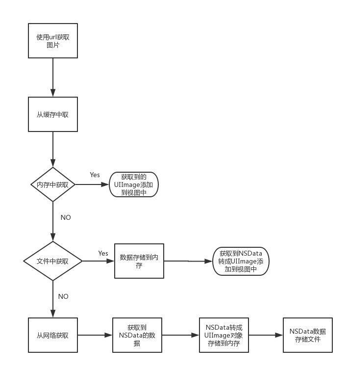

# SDWebImage---源代码分析

### 目录

* [主要流程](#主要流程)

  * [流程图]()
  * [核心逻辑]()

* [阅读代码之前的疑问]()

  * [缓存是如何处理的？]()
  * [怎么识别图片格式(git、webp)然后解码成UIImage]()

  * [如何维护多个下载任务？]()
  * [数据如何转成图片?gif、webp格式的处理？]()

* [阅读代码之后的疑问]()

  * SDWebImageOptions类型的各个值的应用场景

  * **SDMemoryCache** 中为什么要用**weakCache**(弱引用缓存)？

  * **SDWebImageImageIOCoder** 的 **decompressedImageWithImage:** 方法原理是什么？
  * NSURLSession 和 NSURLRequest 怎么配合使用? request的缓存机制是如何?
  * 下载对象(**SDWebImageDownloader**)中的身份验证是如何做的？即:urlCredential(**NSURLCredential * **) 对象如何使用
  * **SDWebImageCombinedOperation** 中的cacheOperation 对象起什么作用

* 应用

  * NSOperation, GCD的应用
  * 使用dispatch_semaphore_t@synchronized 加锁的区别

### 一、主要流程

#### 1.流程图

主要流程:

#### 2.核心逻辑

###二、阅读代码之前的疑问

#### 1.缓存数据如何处理的？

